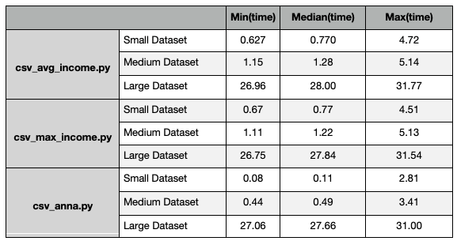
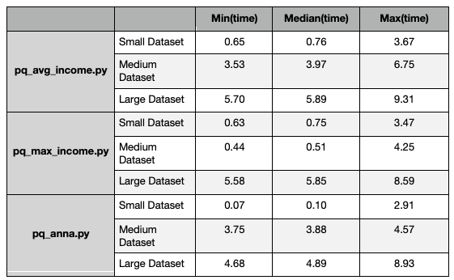
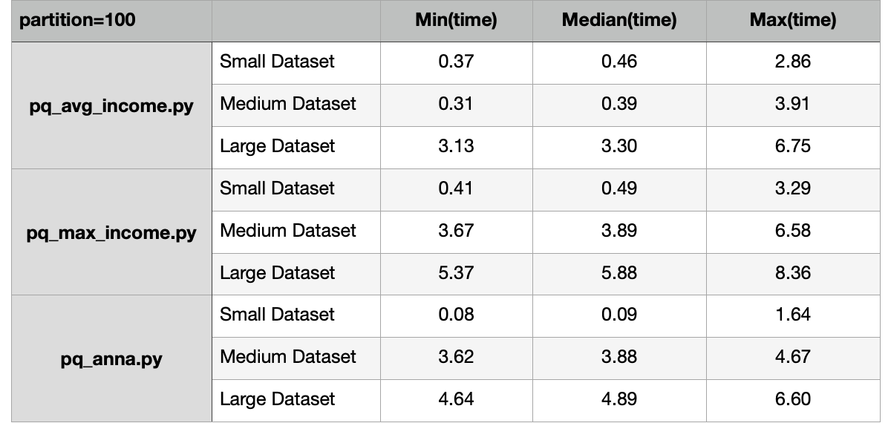
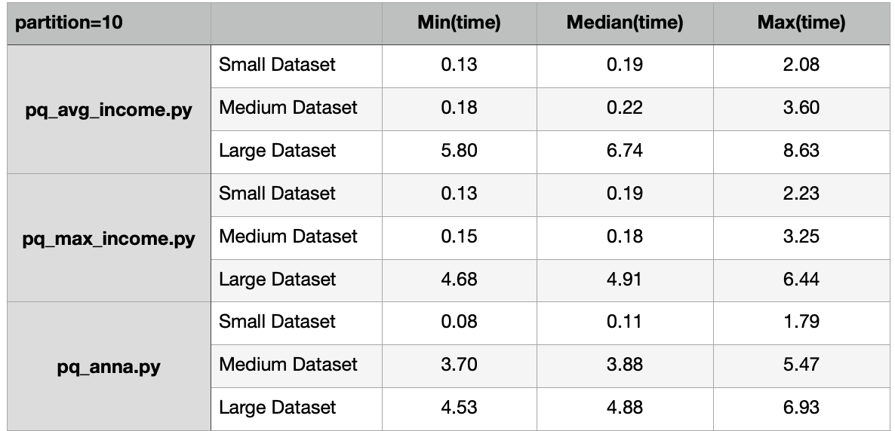
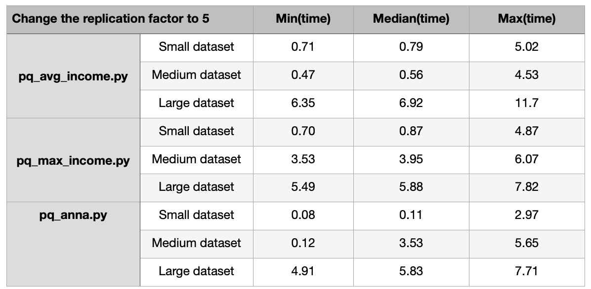
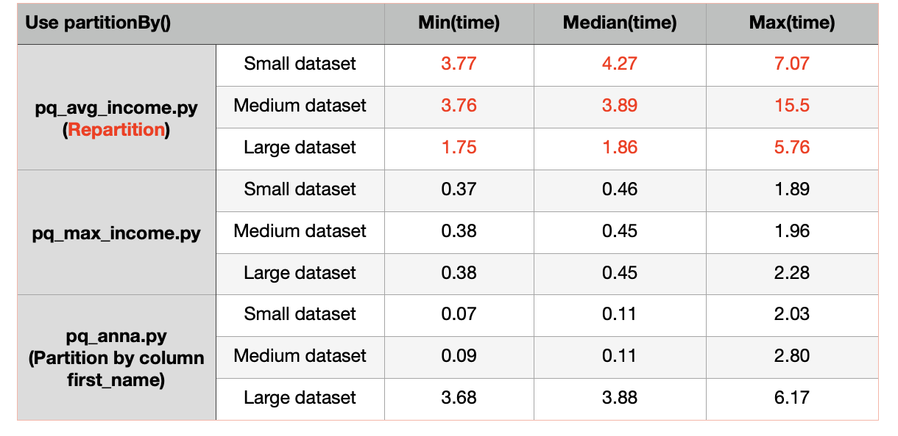

# Lab 3: Spark and Parquet Optimization Report

Name: Opal Yang
 
NetID: qy692

## Part 1: Spark

#### Question 1: 
How would you express the following computation using SQL instead of the object interface: `sailors.filter(sailors.age > 40).select(sailors.sid, sailors.sname, sailors.age)`?

Code:
```SQL
question_1_query = spark.sql("SELECT sid, sname, age FROM sailors WHERE age > 40")
question_1_query.show()
```


Output:
```
+---+-------+----+
|sid|  sname| age|
+---+-------+----+
| 22|dusting|45.0|
| 31| lubber|55.5|
| 95|    bob|63.5|
+---+-------+----+

```


#### Question 2: 
How would you express the following using the object interface instead of SQL: `spark.sql('SELECT sid, COUNT(bid) from reserves WHERE bid != 101 GROUP BY sid')`?

Code:
```python
reserves = spark.read.json(f'hdfs:/user/{netID}/reserves.json')
reserves.createOrReplaceTempView('reserves')
question_2_query = reserves.filter(reserves.bid!=101).groupBy(reserves.sid).agg(count(reserves.bid))
question_2_query.show()
```


Output:
```

+---+----------+
|sid|count(bid)|
+---+----------+
| 22|         3|
| 31|         3|
| 74|         1|
| 64|         1|
+---+----------+

```

#### Question 3: 
Using a single SQL query, how many distinct boats did each sailor reserve? 
The resulting DataFrame should include the sailor's id, name, and the count of distinct boats. 
(Hint: you may need to use `first(...)` aggregation function on some columns.) 
Provide both your query and the resulting DataFrame in your response to this question.

Code:
```SQL
question_3_query = sailors.join(reserves, ["sid"]).groupBy(sailors.sid, sailors.sname).agg(countDistinct(reserves.bid).alias("distinct_boats")).sort(desc("distinct_boats"))
question_3_query.show()

OR 

question_3_query = spark.sql("SELECT temp_reserves.sid, sailors.sname, temp_reserves.num FROM sailors LEFT JOIN (SELECT reserves.sid, COUNT(DISTINCT reserves.bid) AS num FROM reserves GROUP BY reserves.sid) temp_reserves ON sailors.sid = temp_reserves.sid")
question_3_query.show()
```


Output:
```
+----+-------+----+
| sid|  sname| num|
+----+-------+----+
|  22|dusting|   4|
|null| brutus|null|
|  31| lubber|   3|
|null|   andy|null|
|null|  rusty|null|
|  64|horatio|   2|
|null|  zorba|null|
|  74|horatio|   1|
|null|    art|null|
|null|    bob|null|
+----+-------+----+
```

#### Question 4: 
Implement a query using Spark transformations which finds for each artist term, compute the median year of release, maximum track duration, and the total number of artists for that term (by ID).
  What are the results for the ten terms with the shortest *average* track durations?
  Include both your query code and resulting DataFrame in your response.


Code:
```python
def find_median(values_list):
        try:
            median = np.median(values_list) #get the median of values in a list in each row
            return round(float(median),2)
        except Exception:
            return None

def find_max(values_list):
    try:
        maximum = np.max(values_list) #get the max of values in a list in each row
        return round(float(maximum),2)
    except Exception:
        return None

def find_num(values_list):
    try:
        num = np.unique(values_list) #get the unique number of values in a list in each row
        return len(num)
    except Exception:
        return None

def find_mean(values_list):
    try:
        mean = np.mean(values_list) #get the mean of values in a list in each row
        return round(float(mean),2)
    except Exception:
        return None

median_finder = F.udf(find_median,FloatType())
max_finder = F.udf(find_max,FloatType())
num_finder = F.udf(find_num,StringType())
mean_finder = F.udf(find_mean,FloatType())

question_4_query = artist_term.join(tracks, artist_term.artistID == tracks.artistID).groupBy(artist_term.term).agg(
        F.collect_list(tracks.year).alias("YearsOfRelease"),
        F.collect_list(tracks.duration).alias("Durations"),
        F.collect_list(tracks.artistID).alias("ArtistIDs"))

question_4_query = question_4_query.withColumn("MedianYearOfRelease", median_finder("YearsOfRelease")).withColumn("MaximumDuration", max_finder("Durations")).withColumn("NumOfArtist", num_finder("ArtistIDs")).withColumn("MeanDuration", mean_finder("Durations")).sort(asc("MeanDuration"))
question_4_query_final = question_4_query.drop("YearsOfRelease", "Durations", "ArtistIDs", "MeanDuration")
question_4_query_final.show(10)
```


Output:
```
           term|MedianYearOfRelease|MaximumDuration|NumOfArtist|
+----------------+-------------------+---------------+-----------+
|       mope rock|                0.0|          13.66|          1|
|      murder rap|                0.0|          15.46|          1|
|experimental rap|             2000.0|          25.91|          1|
|    abstract rap|             2000.0|          25.91|          1|
|     ghetto rock|                0.0|          26.46|          1|
|  brutal rapcore|                0.0|          26.46|          1|
|     punk styles|                0.0|           41.3|          1|
|     turntablist|             1993.0|         145.89|          1|
| german hardcore|                0.0|          45.09|          1|
|     noise grind|             2005.0|          89.81|          2|
+----------------+-------------------+---------------+-----------+

```
#### Question 5: 
Create a query using Spark transformations that finds the number of distinct tracks associated (through artistID) to each term.
  Modify this query to return only the top 10 most popular terms, and again for the bottom 10.
  Include each query and the tables for the top 10 most popular terms and the 10 least popular terms in your response. 

Code:
```python
#The top 10 most popular terms
question_5_query = artist_term.join(tracks, artist_term.artistID == tracks.artistID).groupBy(artist_term.term).agg(countDistinct(tracks.trackID).alias("distinct_track")).sort(desc("distinct_track"))
question_5_query.show(10)
```

Output:
```
+----------------+--------------+
|            term|distinct_track|
+----------------+--------------+
|            rock|         21796|
|      electronic|         17740|
|             pop|         17129|
|alternative rock|         11402|
|         hip hop|         10926|
|            jazz|         10714|
|   united states|         10345|
|        pop rock|          9236|
|     alternative|          9209|
|           indie|          8569|
+----------------+--------------+
```


Code:
```python
#The bottom 10 terms
question_5_query = artist_term.join(tracks, artist_term.artistID == tracks.artistID).groupBy(artist_term.term).agg(countDistinct(tracks.trackID).alias("distinct_track")).sort(asc("distinct_track"))
question_5_query.show(10)
```

Output:
```
+-----------------+--------------+
|             term|distinct_track|
+-----------------+--------------+
|     italian beat|             1|
|       jazz organ|             1|
|       micromusic|             1|
|      polish kicz|             1|
|     reading 2007|             1|
|  indie argentina|             1|
|            watmm|             1|
|broadway musicals|             1|
|        scenecore|             1|
|     pukkelpop 07|             1|
+-----------------+--------------+
```


## Part 2: Parquet Optimization:

What to include in your report:
  - Tables of all numerical results (min, max, median) for each query/size/storage combination for part 2.3, 2.4 and 2.5.
  - How do the results in parts 2.3, 2.4, and 2.5 compare?
  - What did you try in part 2.5 to improve performance for each query?
  - What worked, and what didn't work?


#### Question 2.3 Benchmarking Queries



#### Question 2.4 CSV vs Parquet



Conclusion: When comparing the speed of running queries on CSV files with the speed of running same queries on parquet files, we observed obvious jump of running speed. For example, with large dataset, the average maximum time we spent on running csv_anna.py is almost 4 times than the time we spent on running pq_anna.py.

#### Question 2.5 Optimizing Parquet

Method 1: Change the number of partitions





Conclusion: Firstly, we changed the number of partitions to 100 and 10 respectively (default is 200), and we found that the speed of running queries on parquet files was getting faster in general. For example, if you compare the result from first table above with the result from table in Question 2.4, you will find that the running time of pq_avg_income.py on medium dataset decreased by >100%.

Method 2: Change the HDFS replication factor to 5



Conclusion: Replication factor dictates how many copies of a block should be kept in our cluster. When we changed replication factor to 5, we didn't see obvious optimization on running speed; we could even observe increase of running time when changed the replication factor to 5(e.g., pq_avg_income.py on large dataset).

Method 3: Partition by column with partitionBy()



Conclusion: When we partition by column first_name and last_name for running pq_anna.py and pq_max_income.py respectively, we observed decreases in running time, but we also found that partition by column name might not be a good option when we have many unique inputs in the column we want to partition by. For example, before running pq_avg_income.py, we partitioned by column zipcode. This partitioning process was really time consuming because of the large amount of unique zipcodes in column zipcode. Thus, in this case, it'd be better to avoid applying partition. As a result, I applied repartition on column zipcode and the running time decreases substantially, especially when running queries on large dataset.

Basic Markdown Guide: https://www.markdownguide.org/basic-syntax/
